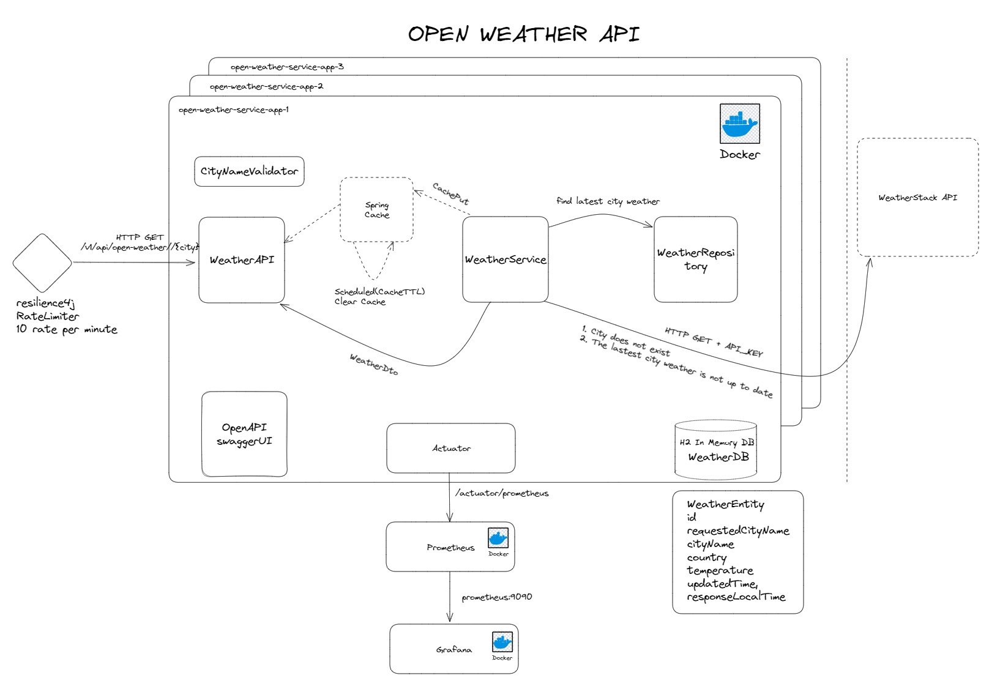

# Open Weather Service Application

## Source : [folksdev-weather-repo](https://github.com/folksdev/open-weather)

---

### Overall Architecture



### The service provides an API

#### `WeatherAPI`

* To search current weather report by city name.

### How does the application works?

* The application processes requests received through the `/v1/api/open-weather/{city}` URL with `{city}` as a path
  variable.
* City parameter validation is performed to ensure that the value is not blank or decimal.
* If the city value is invalid, the API responds with a 400 - Http Bad Request status code.
* The current weather report can be obtained from either the database or the WeatherStackAPI using an API_KEY.
* If the most recent data for that city is no more than 30 minutes old, it is retrieved from the database.
* If the city does not exist in the database or the data is older than 30 minutes, a request is sent to the
  WeatherStackAPI, and the result is stored in the cache.
* If there is a value with the city filter as the cache key, the response is returned directly from the cache.

The relevant API endpoint can be found on the Swagger page, which is accessible via
the `http://localhost:8080/swagger-ui/index.html` URL.

You can set the <b>WEATHER_STACK_API_KEY<b> in the `.env` file.

## Technologies

---

- Java 17
- Spring Boot 3.0
- Open API Documentation
- Spring Data JPA
- Kotlin
- H2 In Memory Database
- Restful API
- Maven
- Docker
- Docker Compose
- Prometheus
- Grafana

## Prerequisites

---

- Maven or Docker

---

## Docker Run

The application can be built and run by the `Docker` engine. The `Dockerfile` has multistage build, so you do not need
to build and run separately.

Please follow the below directions in order to build and run the application with Docker Compose;

```sh
$ cd open-weather
$ docker-compose up -d
```

Docker compose creates 3 replicas (instances) of the application on port range 9595-9597

---

#### You can reach the open-api-ui via  `http://{HOST}:{9595-9597}/swagger-ui.html`

---

You can reach the swagger-ui via  `http://{HOST}:8080/swagger-ui.html`

---